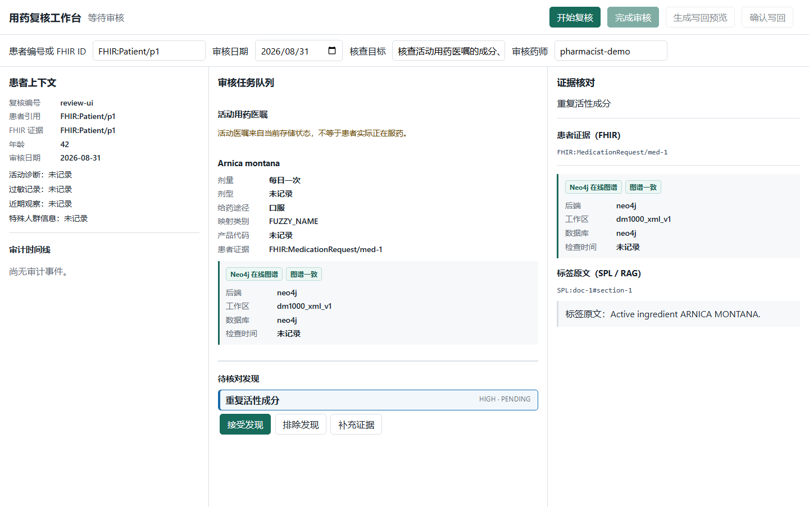

# Patient Medication Evidence Workbench

面向药师的用药证据复核闭环：读取合成 FHIR 病历，核对 DailyMed SPL、Neo4j 与
Milvus/LightRAG 证据，在人工确认后预览并幂等写回 FHIR。Agent 负责受控编排，药师
保留产品选择、Finding 决策和最终写回权。



[设计规格](docs/superpowers/specs/2026-09-04-patient-medication-evidence-workbench-design.md) ·
[实施路线图](docs/superpowers/plans/2026-09-04-patient-medication-evidence-workbench-roadmap.md) ·
[架构详解](docs/portfolio/architecture.md) ·
[演示脚本](docs/portfolio/demo-script.md)

## 问题与用户

药师核查活动用药医嘱时，需要在患者病历、产品标识、标签原文和图谱事实之间反复切换。
真正困难的不是生成一份报告，而是保证每个核查结论能回到同一患者、已确认产品和可验证
证据，并在写回前保留人的最终判断。

本项目的核心用户是医院或药房药师。输入是患者编号/FHIR 引用、核查时点和自然语言核查
目标；输出是带双侧引用的 Finding、待补信息和经药师确认的 FHIR 新增资源预览。

## 三分钟看懂业务闭环

1. 药师输入合成患者标识、`asOf` 和核查目标，Agent 读取 Health MCP。
2. 每条活动用药医嘱都调用一次药品解析；歧义候选必须由药师选择。
3. 系统按确认后的产品和 SPL 版本查询结构化事实与标签原文，形成 FHIR + SPL 配对 Finding。
4. 药师接受、排除或要求补证据；单 Finding 最多补查一次，避免无限 Agent 循环。
5. 完成审核后生成 `DetectedIssue`、`Task`、`Provenance` 预览，二次确认后事务提交；重复提交不新增资源。

三张关键画面：[产品歧义](docs/portfolio/assets/01-ambiguous-product.png)、
[Finding 与证据](docs/portfolio/assets/02-finding-evidence.png)、
[FHIR 写回预览](docs/portfolio/assets/03-writeback-preview.png)。

## 架构与责任边界


Workbench 只调用 FastAPI；FastAPI 持有 ReviewState、SQLite checkpoint、乐观版本和 reviewer
身份。LangGraph 调用两个相互独立的 MCP：Health Record MCP 提供患者上下文与窄写回工具，
Drug Evidence MCP 提供产品解析、Neo4j 事实和 Milvus/LightRAG 标签证据。

LLM 只做结构化意图规划、最多一次语义覆盖判断和可选摘要。患者范围、产品候选、检索预算、
引用验证、Finding 规则和 FHIR Bundle 均由确定性代码控制；模型对象拿不到写回 gateway。
完整接口与信任边界见[架构文档](docs/portfolio/architecture.md)。

四个实现子计划：
[LLM 编排](docs/superpowers/plans/2026-09-04-patient-medication-evidence-workbench-01-llm-orchestration.md)、
[FHIR 写回](docs/superpowers/plans/2026-09-04-patient-medication-evidence-workbench-02-fhir-writeback.md)、
[工作台闭环](docs/superpowers/plans/2026-09-04-patient-medication-evidence-workbench-03-workbench.md)、
[评测与作品集](docs/superpowers/plans/2026-09-04-patient-medication-evidence-workbench-04-evaluation-portfolio.md)。

## 为什么是一个受控 Agent

首版故意不使用自由 ReAct 或多 Agent。这个流程有清晰状态、强一致性写回和低容错的医疗
边界，一个受控状态机更容易回答“为什么停在这里、还能调用几次、谁批准了什么”。

- LangGraph 负责可恢复中断和确定性路由，不允许模型自由选择工具。
- 模型输出必须通过 Pydantic schema、主题白名单和本地安全策略；失败时显式降级。
- 每产品每主题最多两次正文检索，每个 Finding 最多一次人工补证据，每个 review 最多三次 LLM 调用。
- 用户问题、FHIR 文本和 SPL 片段都视为不可信内容，不能扩大产品范围、工具权限或循环预算。

只有多知识域、十种以上用药或 P95 延迟证明需要拆分时，才考虑多 Agent。

## Human-in-the-loop 与写回安全


人工中断发生在患者不唯一、产品歧义/模糊和 Finding 审核。所有 resume 都带当前候选、
`reviewerId` 与 `expectedVersion`；陈旧版本返回 409，不会覆盖新决定。药师要求补证据时从
checkpoint 定向恢复，但同一 Finding 第二次请求会被预算阻断。

写回与 Review 状态分离。`prepare` 是不可变预览且零写入；`commit` 要求 API key、匹配的
药师身份、已完成 review、当前版本、`confirmed=true` 和一致的 `bundleHash`。Health MCP
只新增白名单资源，并用确定性 ID、事务和 `reviewId + reviewVersion` 实现幂等。

## 本地运行

要求 Python 3.11+，并准备可访问的 Neo4j、Milvus 和模型配置。安装 Agent：

```powershell
Set-Location C:\Users\Administrator\Downloads\dm_spl_release_homeopathic\homeopathic\medication_review_agent
python -m pip install -e ".[test]"
$env:AGENT_MODEL_ENV_PATH = "C:\Users\Administrator\Downloads\dm_spl_release_homeopathic\homeopathic\LightRAG\.env"
```

终端 1，Health MCP：

```powershell
Set-Location C:\Users\Administrator\Desktop\mcp\health-record-mcp\Agent
python mcp/mcp_server.py --transport http --host 127.0.0.1 --port 8000
```

终端 2，Drug MCP：

```powershell
Set-Location C:\Users\Administrator\Downloads\dm_spl_release_homeopathic\homeopathic\dailymed_lightrag
python -m medication_review_agent.dailymed_compat --transport http --host 127.0.0.1 --port 8010
```

终端 3，Review API：

```powershell
Set-Location C:\Users\Administrator\Downloads\dm_spl_release_homeopathic\homeopathic\medication_review_agent
$env:HEALTH_MCP_URL = "http://127.0.0.1:8000/mcp"
$env:DRUG_MCP_URL = "http://127.0.0.1:8010/mcp"
$env:AGENT_LLM_ENABLED = "true"
$env:ALLOW_INSECURE_LOCAL_MUTATIONS = "true"
Remove-Item Env:REVIEW_API_KEY -ErrorAction SilentlyContinue
$env:REVIEW_API_REVIEWER_ID = "pharmacist-demo"
medication-review-api
```

打开 `http://127.0.0.1:8020`。`ALLOW_INSECURE_LOCAL_MUTATIONS` 只用于回环地址上的浏览器演示；
自动化评测或非回环部署必须改用 `REVIEW_API_KEY` 和受控客户端。API 只支持单 worker；多进程
会绕过当前进程内 mutation 锁，因此启动时由 checkpoint lease 明确拒绝。

## 测试与评测

Core 与浏览器测试必须在两个进程中运行：

```powershell
$env:PYTEST_DISABLE_PLUGIN_AUTOLOAD = "1"
python -m pytest tests --ignore-glob=tests/test_web_*.py -q -p pytest_asyncio.plugin

Remove-Item Env:PYTEST_DISABLE_PLUGIN_AUTOLOAD -ErrorAction SilentlyContinue
python -m pytest tests/test_web_render.py tests/test_web_decisions.py tests/test_web_visual.py -q
```

离线 Fixture 回归和真实在线集成也使用不同入口与报告名：

```powershell
powershell -ExecutionPolicy Bypass -File scripts/run-offline-evaluation.ps1
powershell -ExecutionPolicy Bypass -File scripts/run-live-evaluation.ps1
```

在线 launcher 创建 `artifacts/live-runs/<timestamp>`，复制并播种隔离 Health 数据库，只传递
`AGENT_MODEL_ENV_PATH` 而不读取或打印密钥，只停止自身启动的进程。`-CommitSynthetic` 会
提交两次验证幂等，并校验源数据库哈希和修改时间不变。preview 与 commit 两种模式都会在
启动前拒绝已占用的 8000、8010、8011、8020、8021 端口，避免误用其他进程的服务。

## 结果：离线与在线

离线回归：15/15 通过；paired citation validity、exact identifier accuracy、missing
information recall 和 task completion 均为 1.0。它使用 `FixtureHealthGateway`、
`FixtureDrugGateway` 与 `DeterministicPlanner`，不能代表线上质量或延迟。

最新真实在线运行（`66d7ff0`）：Health/Drug MCP 与真实数据库链路完成 5/5 个 case，全部到达
`SIGNED_OFF` 并生成写回预览；引用有效率、精确标识准确率、缺失信息召回率、任务完成率和
指标覆盖率均为 1.0，五项零容忍安全计数均为 0。每个 case 都独立观察到两个 MCP；模型端点在五次规划中都发生
`MODEL_UPSTREAM_ERROR` 并显式回退，因此 `realModel=false`、整体 `acceptancePassed=false`。
这个结果证明业务闭环和降级路径可用，但不代表真实模型质量已经验收。

可公开结果：[离线摘要](docs/portfolio/results/offline-regression-summary.json) ·
[在线摘要](docs/portfolio/results/online-integration-summary.json) ·
[结果说明](docs/portfolio/results/README.md)。

## 演示路径

按[三分钟演示脚本](docs/portfolio/demo-script.md)操作：先展示歧义产品人工确认，再接受一个
带 FHIR/SPL 双引用的 Finding，对另一个请求一次补证据，最后完成审核、查看 Bundle 预览并
执行幂等重放。十分钟版本在同一文档中给出八个常见面试追问的源码与测试落点。

## 关键取舍与失败案例

核心取舍是“规则控制安全和写回，模型只处理适合语义判断的部分”；报告只是 ReviewState
投影，不是主业务。已观察并记录模型上游降级、Milvus 故障与 MCP/LightRAG 生命周期修复，
以及 stale version/写回冲突；每个案例都包含失败码、安全行为和回归测试，见
[取舍与失败复盘](docs/portfolio/tradeoffs-and-failures.md)。

## 医疗、数据和部署边界

本项目只使用合成数据，不提供诊断、处方、停药、换药、剂量调整或完整药物相互作用判断。
MedicationRequest 始终称为“活动用药医嘱”，不声称患者实际服药；缺失数据不能解释为阴性
或不存在。DailyMed 标签证据也不是治疗建议。

患者姓名、编号、完整 Patient ID、完整 FHIR payload 和原始附件不发送给 LLM 或 Drug MCP。
当前是本地单 worker 求职项目，不是生产 EHR、公网服务或多租户部署方案。

## 后续演进条件

- 恢复模型端点后重跑五例在线评测，要求 `realModel=true` 后才能把当前 5/5 业务完成升级为完整在线验收。
- 用独立临床标注集验证缺失信息 recall，再讨论生产阈值和告警。
- 多 worker 前把 mutation lock、checkpoint lease 和幂等协调迁移到共享基础设施。
- 只有新增相互作用库/指南等独立知识域，或单患者十种以上用药造成可测延迟瓶颈时，才拆分多 Agent。
