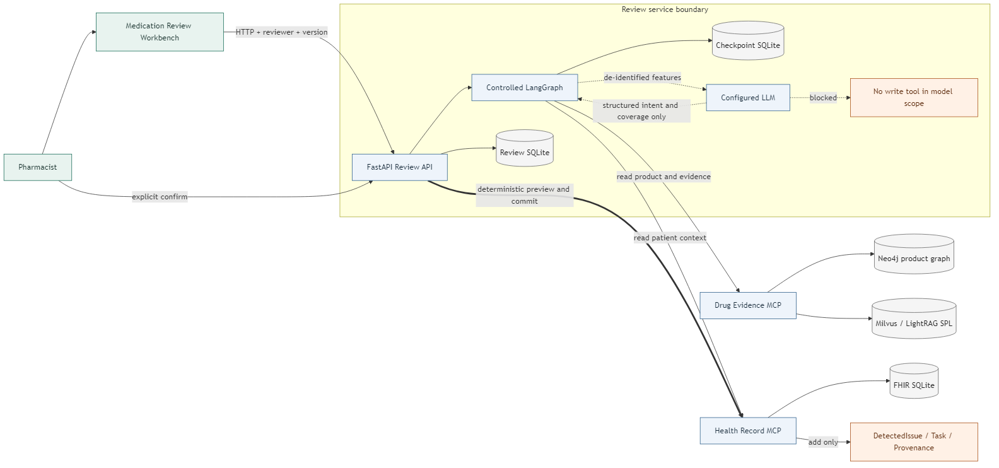
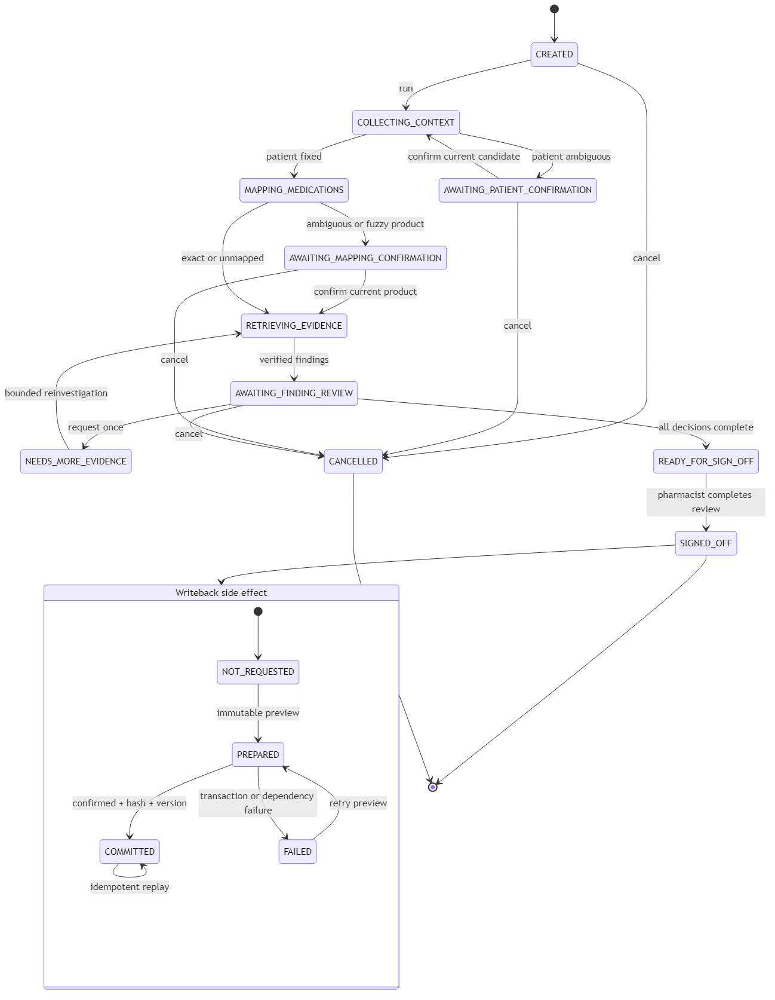

# 架构与证据链

## 业务目标

系统帮助药师把患者侧活动用药医嘱和产品侧标签证据放到同一审核任务中。领域结果是可恢复的
`ReviewSnapshot`，报告只是它的只读投影；主流程的终点是药师完成审核并决定是否写回 FHIR。

## 组件职责

| 组件 | 负责 | 明确不负责 |
|---|---|---|
| Workbench | 展示患者、映射、Finding、证据、预览和确认操作 | 自行推断产品或修改状态 |
| FastAPI | 鉴权、reviewer 绑定、版本检查、写回编排、单 worker lease | 把写权限交给模型 |
| LangGraph | 确定性节点路由、checkpoint、中断与一次补证据恢复 | 自由 ReAct 或无限循环 |
| LLM | 结构化 intent/topic、一次语义覆盖判断、可选摘要 | 患者选择、产品选择、Finding 接受、FHIR 构造 |
| Health MCP | 读取患者范围内 FHIR；校验并事务提交白名单 Bundle | 调用 Drug MCP 或修改原资源 |
| Drug MCP | 产品解析、Neo4j 事实、Milvus/LightRAG SPL 证据 | 接收患者身份或写病历 |



## 一条 Finding 如何形成

```text
FHIR:MedicationRequest/med-1
  -> normalize medication fields
  -> resolve_medication (exact or pharmacist-confirmed product)
  -> DRUG_PRODUCT::10191-1246
  -> product facts + SPL document/version scoped retrieval
  -> deterministic comparison/rule
  -> Finding(patientEvidenceRefs + labelEvidenceRefs)
  -> verifier
  -> pharmacist decision
  -> DetectedIssue/Task + Provenance preview
```

非 `EVIDENCE_GAP` Finding 缺少任何一侧引用都不能接受。SPL 引用还要绑定已确认产品、文档
版本、section 和 content hash，避免跨产品或索引漂移造成的“看似相关”。

## 状态与并发



Review 状态描述业务审核进度，Writeback 状态描述副作用，两者独立：审核已经 `SIGNED_OFF`
时，写回仍可处于 `NOT_REQUESTED`、`PREPARED`、`COMMITTED` 或 `FAILED`。失败不会撤销药师
决定，重试仍受相同 job、版本和 hash 约束。

每次 mutation 使用：

```text
API key + reviewer identity + expectedVersion
  -> review-scoped async lock
  -> mutation journal PREPARED
  -> LangGraph checkpoint advance
  -> repository compare-and-swap save
  -> journal COMMITTED
```

异常恢复根据 journal 判断回滚 checkpoint 还是补齐 repository save。API 明确只支持一个
worker，第二进程会在 lifespan 中因 checkpoint lease 启动失败。

## LLM 与数据最小化

模型只收到去标识化 `PatientFeatures`、`MedicationFeatures`、用户问题和允许主题。完整 Patient
ID、姓名、患者编号、FHIR payload、原始附件、MCP 写回工具和数据库句柄均不进入模型上下文。

Planner 输出经过 Pydantic schema、主题白名单和安全策略；模型异常会产生带
`failureCode` 的 `ModelCallRecord` 并落到 `DeterministicPlanner`。Evidence grader 只能决定
当前产品/主题是否需要一次改写，不能改变产品 ID、文档版本或最大尝试次数。

## MCP 与写回边界

Health MCP 与 Drug MCP 不互相调用，也不共享数据库。Health MCP 暴露两个窄写回工具：

```text
validate_medication_review_writeback(payload)
commit_medication_review_writeback(jobId, bundleHash, expectedVersion, confirmed, reviewerId)
```

只有 FastAPI 的 `WritebackCoordinator` 可调用。preview 冻结结构化 payload 并计算 hash，不写库；
commit 校验相同 job/hash/version/confirmed/reviewer，在单个 SQLite 事务中只新增 `DetectedIssue`、
`Task`、`Provenance`。`Provenance.recorded` 取自持久化的 `SIGN_OFF.occurredAt`，而不是构建
Bundle 时临时生成；时间和 Bundle 一起参与不可变预览。重复相同请求返回原资源 ID，不重复
插入；同版本不同 hash 返回冲突。

## 预算与故障语义

| 类别 | 上限/行为 |
|---|---|
| Health context | 首次 1 次，患者澄清后可重取 1 次 |
| Medication resolution | 每条活动用药医嘱 1 次 |
| Product facts | 每个已确认产品 1 次 |
| Narrative retrieval | 每产品每主题最多 2 次 |
| Human reinvestigation | 每 Finding 最多 1 次 |
| LLM | 每 review 最多 3 次 |
| Writeback | preview 每版本 1 次；commit 可幂等重试 |

超时、连接重置、429 和显式 retryable 错误可以有限重试。患者/产品歧义、schema 失败和引用
验证失败不能“重试成成功”。服务不可用必须表示为 gap 或失败，不能表达为“没有相关事实”。

## 可观测性

审计只保存节点、工具名、结果状态、引用 ID、延迟、重试、模型 ID、prompt version、token、
估算成本和 fallback 标记，不保存 prompt、隐藏推理、原始患者 payload、SQL、Cypher 或 raw
tool arguments。在线评测从 `/audit` 聚合 node trace、tool status 和 per-node latency，并将
缺失字段计入 `missingMetrics`。患者范围、精确产品、缺失字段使用独立 case oracle；accepted
Finding 中的 FHIR 引用必须在隔离 Health SQLite 中归属期望患者，SPL 引用必须解析到同一药品的
`evidenceIndex`，且包含 document version/content hash；源 FHIR 不变和重复写回则由数据库前后
快照实测。任一项未测量都会降低 coverage。

## 源码入口

- 状态与 schema：`src/medication_review_agent/models.py`
- LangGraph：`src/medication_review_agent/workflow.py`
- 受控检索：`src/medication_review_agent/retrieval.py`
- API 与并发：`src/medication_review_agent/api.py`
- 写回协调：`src/medication_review_agent/writeback.py`
- 在线评测：`src/medication_review_agent/online_evaluation.py`
- Health MCP 写回：Health 仓库 `mcp/writeback_service.py`
